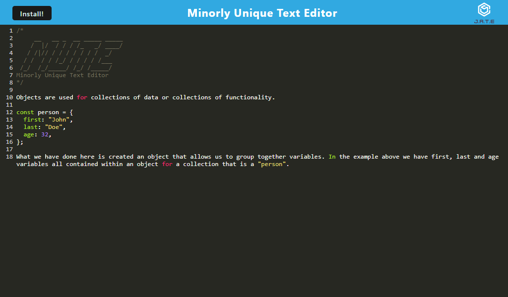

# M.U.T.E.

## Description

M.U.T.E (Minorly Unique Text Editor) is a text editor that runs in the browser. It is a PWA (progressive web application) that features a number of data persistence techniques that serve as redundancy in case one of the options is not supported by the browser. The application will also function offline. You can take notes that standout with JavaScript syntax highlighting.

## Built With

- Express
- Webpack
- Babel
- HTML
- CSS

## Getting Started

To get a local copy up and running follow these simple example steps.

### Installation

- Clone the repo
  ```sh
  git clone git@github.com:erikbenedict/minorly-unique-text-editor.git
  ```
- Install NPM packages
  ```sh
  npm i
  ```
- Run build to bundle modules and assets
  ```sh
  npm run build
  ```
- Start the application
  ```sh
  npm start
  ```

## Usage

Using this PWA is very simple and straight forward. You can take notes normally by entering text into the editor, and your code snippets will stand out with JavaScript syntax highlighting. You can also install the application and pin it to your taskbar for easy access and to use offline! Any notes taken offline will persists so you will never lose your content.

Below is a screenshots of the application



## Deployed Application

[Click here to try M.U.T.E. for yourself!](https://mute-8aface8efda8.herokuapp.com/)

## Contributing

Contributions are what make the open source community such an amazing place to learn, inspire, and create. Any contributions you make are greatly appreciated.

If you have a suggestion that would make this better, please fork the repo and create a pull request. Don't forget to give the project a star! Thanks again!

1. Fork the Project
2. Create your Feature Branch (`git checkout -b feature/AmazingFeature`)
3. Commit your Changes (`git commit -m 'Add some AmazingFeature'`)
4. Push to the Branch (`git push origin feature/AmazingFeature`)
5. Open a Pull Request

## License

Distributed under the MIT License. See [MIT](https://choosealicense.com/licenses/mit/) for more information.

## Contact

If you have any questions please reach out via email!

- Email: erik.r.benedict@gmail.com
- Twitter: [@\_Erik_Benedict](https://twitter.com/_Erik_Benedict)
- Project Link: [https://github.com/erikbenedict/minorly-unique-text-editor](https://github.com/erikbenedict/minorly-unique-text-editor)
